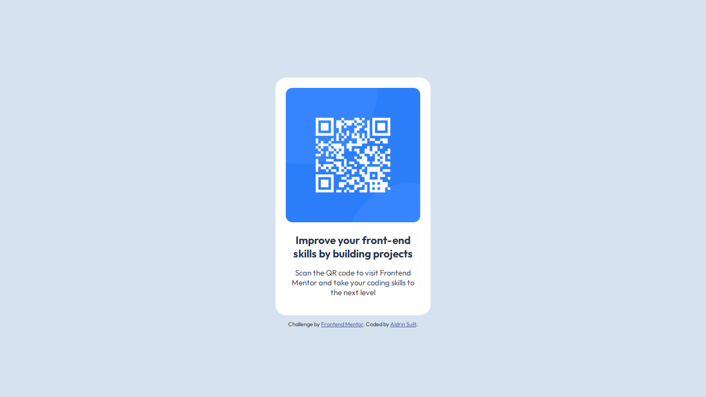

# Frontend Mentor - QR code component solution

This is a solution to the [QR code component challenge on Frontend Mentor](https://www.frontendmentor.io/challenges/qr-code-component-iux_sIO_H). Frontend Mentor challenges help you improve your coding skills by building realistic projects.

## Table of contents

- [Overview](#overview)
  - [Screenshot](#screenshot)
  - [Links](#links)
- [My process](#my-process)
  - [Built with](#built-with)
- [Author](#author)

## Overview

### Screenshot

### Links

- Solution URL: [https://github.com/aljersulit/qr-code-component-solution](https://github.com/aljersulit/qr-code-component-solution)
- Live Site URL: [https://aljersulit.github.io/qr-code-component-solution/](https://aljersulit.github.io/qr-code-component-solution/)

## My process

### Built with

- HTML5 markup
- CSS custom properties
- Flexbox

## Author

- GitHub Profile - [Aldrin Sulit](https://github.com/aljersulit)
- Frontend Mentor - [@AljerEfficient12](https://www.frontendmentor.io/profile/AljerEfficient12)
